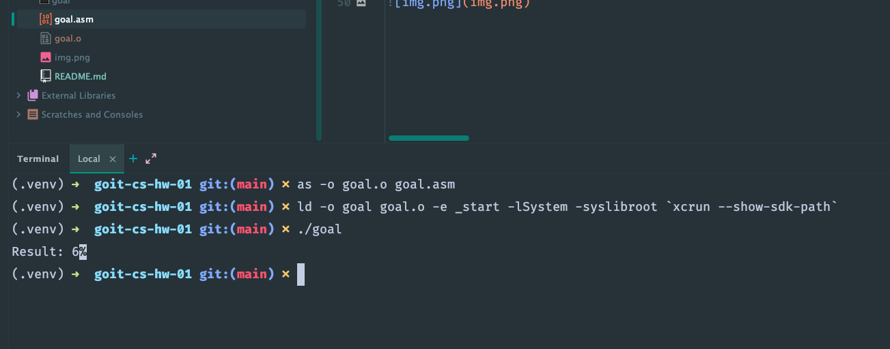
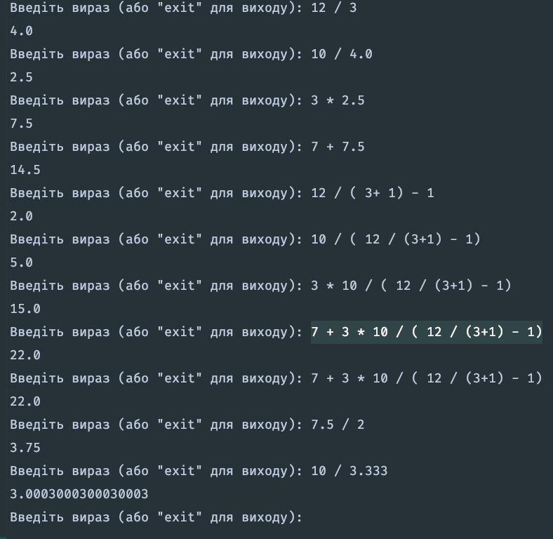

## Task01 ##

Початковий текст програми calc.asm був створений для 16-bit систем. У завданні вказується, що потрібно встановити DOSBox емулятор операційної системи MS-DOS і там виконати цей код на якомусь з асемблерів. Я зіткнувся з деякими складнощами реалізації цього плану. Оскільки в мене ноутбук з архітектурою процесора arm64 на процесорі Apple M2, то я зіткнувся з тим, що ці інстурукції не виконувалися на ньому навіть на емуляторі ms-dos. Крім того, не вдалося знайти .exe файл turbo-асемблера, були тільки архівні варіанти у вигляді .img-файлів розміром 1.44MB для дискет. Усі ці незручності змусили мене скористатися native асемблером, встановленим у MAC OS (програма as), і, звісно, довелося переписати цей код під особливості процесора і 64-bit архітектуру.

Я домігся виконання цього коду у два проходи (асемблювання і компонування) і описав весь процес у цьому файлі. Єдиний баг, який не вдалося побороти, - це виведення після потрібного нам символу цифри 6 знака % - це, ймовірно, якесь сміття в буфері виведення, якого ніяк не вдається позбутися. Швидше за все, це пов'язано з викликом write, але пошуки інформації в google і chatGPT поки що до успіху не привели. Але оскільки основним завданням тут, як я бачу, є модифікація програми на асемблері, щоб змінити порядок операцій, то я вирішив, що цей маленький баг не може стати перешкодою, щоб викласти тут суть усього процесу.

Отже, переписана під arm64 програма для асемблера _**as**_, який постачається у складі операційної системи Sequoia, представлена у файлі calc.asm. Про те, як я асемблював і збирав виконуваний файл calc, викладено наприкінці цієї секції. Змінений код, щоб він змінив порядок виконання операцій (що і було метою цього завдання), я помістив у файл goal.asmю Відповідно, виконуваний файл - goal.

---
- Для macOS на ARM64 (M2) код потрібно переписати з урахуванням архітектури AArch64 і системних викликів macOS.
- В ARM64 регістри w0-w30 використовуються для 32-бітних операцій, x0-x30 для 64-бітних.
- Ми використовуємо w0-w2 для зберігання a, b, c і їхньої обробки.
- У macOS системний виклик write (syscall 4) використовується для виведення тексту.
- Виклик робиться через svc #0x80, який аналогічний syscall у x86_64.
- Результат зберігається в res, який потім передається в write.
- Використовується системний виклик exit (syscall 1), передаємо код повернення 0.

Спочатку було використано популярний асемблер NASM, але NASM не розпізнає синтаксис коду, тому що NASM призначений для x86 і x86_64, а не для ARM64 (AArch64). GNU Assembler (_**as**_) на macOS не підтримує завантаження глобальних міток з ldrb безпосередньо. В AArch64 потрібно використовувати adrp + add або завантажувати адресу через ldr xN, =ім'я_змінної.

- У macOS не можна безпосередньо завантажувати адреси глобальних змінних.
-- Рішення: Завантажуємо адресу через таблицю GOT (ldr xN, [reloc_a]).
- Використовуємо reloc_* в __DATA_CONST,__got
-- Це дозволяє лінкеру правильно обробити адреси.

- В ELF (**Linux**) можна просто ldr x1, [reloc_res], і все працює.
- У Mach-O GOT-адреси завантажуються через PC-relative (ldr x1, reloc_res@GOT)
- @PAGE завантажує верхні 16 біт адреси. @PAGEOFF додає молодшу частину адреси.
- Додаємо NULL-термінатор (0x00) у res після цифри.
- Коригуємо кількість байтів у mov x2, 1, щоб write зчитував тільки 6, а не зайві байти.
---

#### Як запускати ####
**асемблювання**

as -o goal.o goal.asm

**компонування**

ld -o goal goal.o -e _start -lSystem -syslibroot \`xcrun --show-sdk-path\`

**запуск**

./goal

### Результат наступний ###

## Task02 ##
